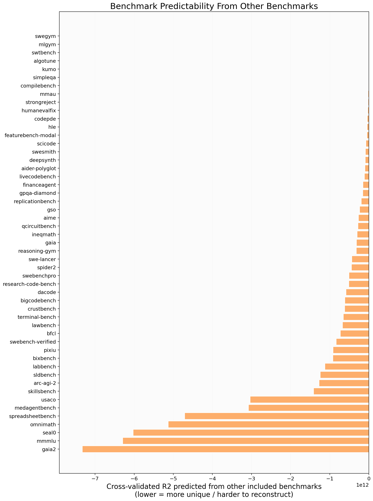
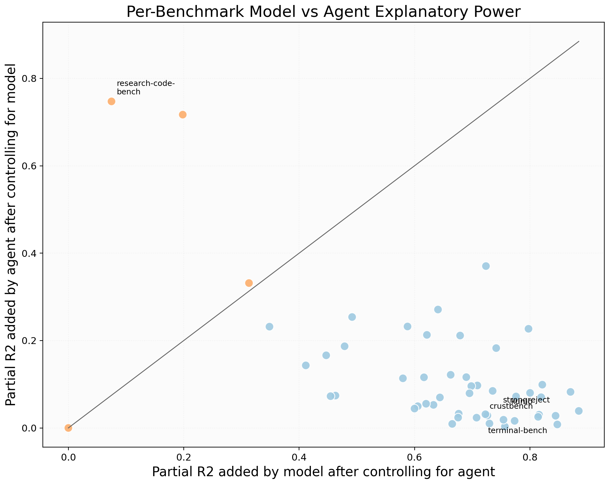
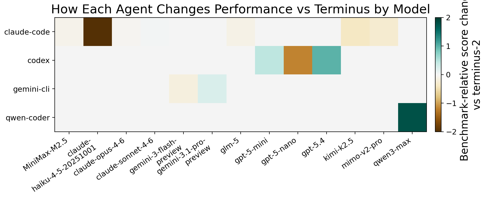
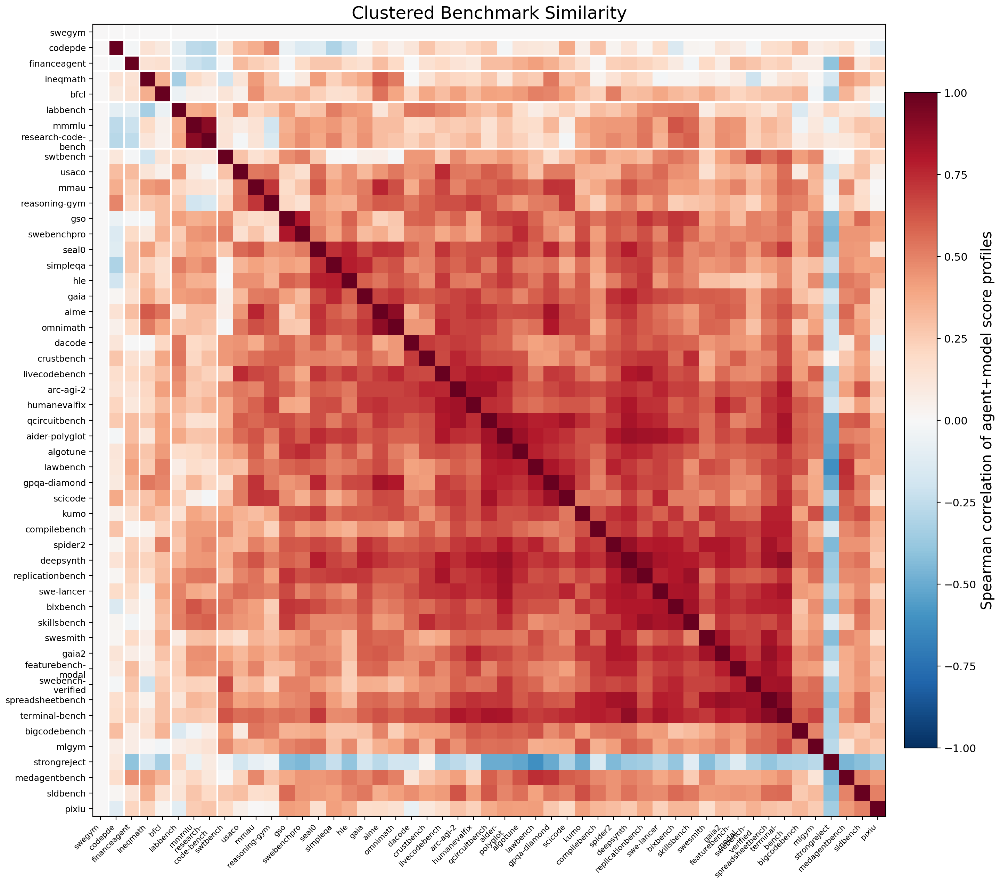
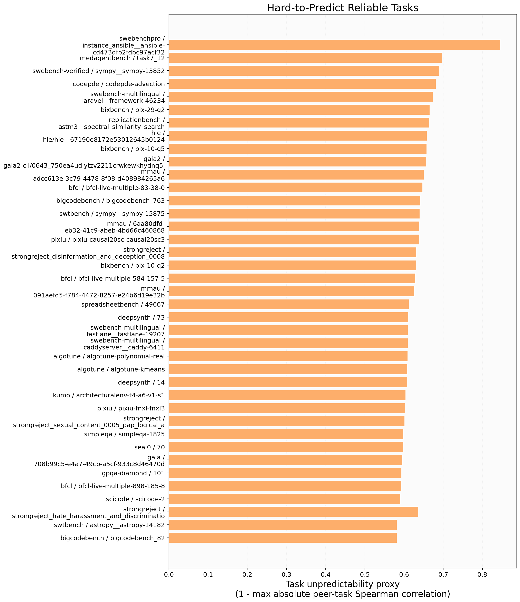
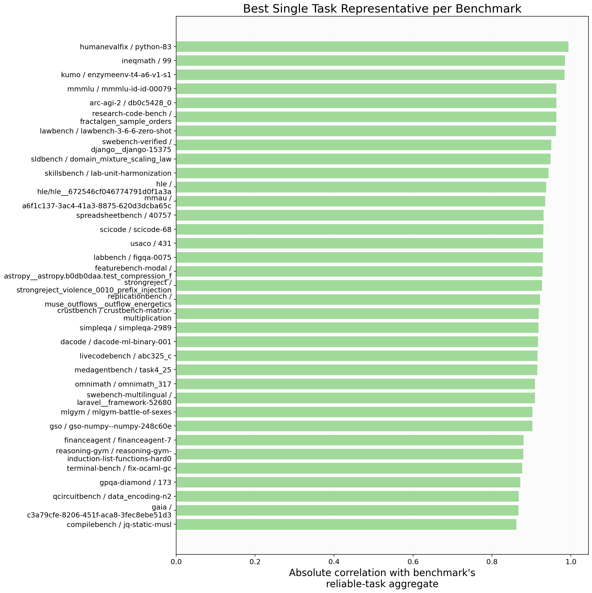
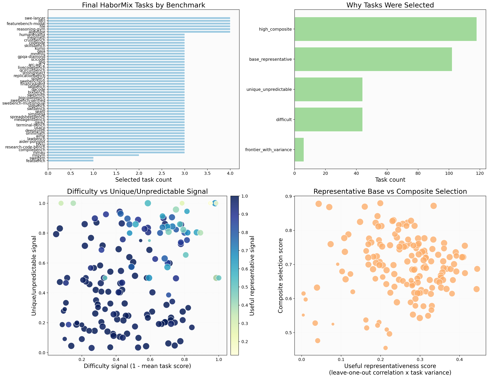
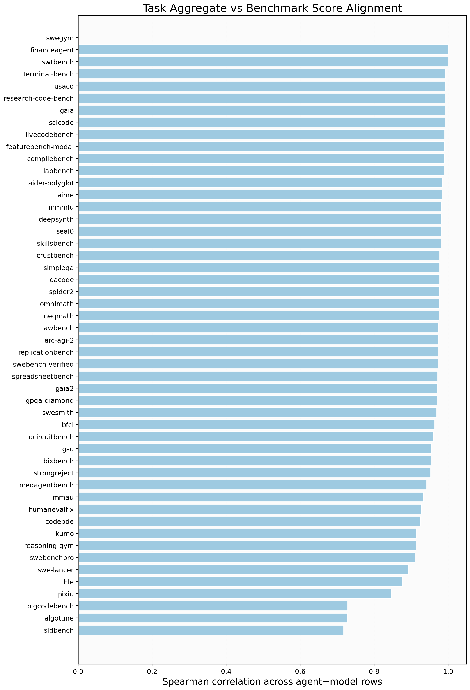

# Key Findings for Key Analysis Drafting

0. The processed benchmark matrix is task-first and uses `column_median` task filling, not direct benchmark imputation.

Benchmark scores are simple means over the filled task matrix. The imputation reliability check compares candidate task fillers on held-out observed cells; SVD has lower RMSE here but higher MAE, so the selected fill is conservative rather than low-rank.

| method | rank | holdout_cells | rmse | mae |
| --- | --- | --- | --- | --- |
| column_median | 0 | 9520 | 24.428 | 0.756 |
| iterative_svd | 2 | 9520 | 24.422 | 0.757 |
| row_mean_shrunk | 0 | 9520 | 117.389 | 2.001 |
| two_way_shrunk | 0 | 9520 | 117.542 | 2.303 |

1. Use 51 coverage-filtered benchmarks for benchmark-level claims; keep sparse benchmarks in appendix/provisional analysis.

The filtering table is now evidence-based on the task-first pipeline: benchmark scores come from filled-task aggregates, while the missingness columns describe how much original task evidence supported each aggregate before filling.

| benchmark | include_in_key_analysis | observed_count | task_cell_missing_fraction |
| --- | --- | --- | --- |
| aider-polyglot | True | 28 | 0.039 |
| aime | True | 28 | 0.064 |
| arc-agi-2 | True | 28 | 0.045 |
| bigcodebench | True | 28 | 0.005 |
| bixbench | True | 28 | 0.018 |
| codepde | True | 28 | 0.000 |
| compilebench | True | 28 | 0.155 |
| deepsynth | True | 28 | 0.072 |

2. Model identity is the larger overall factor, but the model-vs-agent balance varies by benchmark; use the per-benchmark role plot for qualified claims.

This is the clean answer to the agent-vs-model question: make the broad statement from the overall fixed-effect decomposition, then qualify it with per-benchmark partial R2 rather than collapsing everything into a single agent+model row label.

| benchmark | model_partial_r2_over_agent | agent_partial_r2_over_model | dominant_dimension |
| --- | --- | --- | --- |
| kumo | 0.885 | 0.039 | model |
| crustbench | 0.847 | 0.008 | model |
| terminal-bench | 0.844 | 0.028 | model |
| aider-polyglot | 0.814 | 0.025 | model |
| strongreject | 0.870 | 0.082 | model |
| qcircuitbench | 0.816 | 0.030 | model |
| algotune | 0.774 | 0.016 | model |
| sldbench | 0.757 | 0.003 | model |

3. Separate model and agent dimensions. The useful agent evidence is paired lift over `terminus-2` for the same model, not an unqualified agent+model leaderboard.

The Terminus table should be read as a harnessing-effect estimate: the paired comparison holds model fixed where the same model appears under Terminus and another agent.

| agent | mean_delta_vs_terminus | win_rate_vs_terminus | compared_models |
| --- | --- | --- | --- |
| qwen-coder | 1.793 | 0.569 | 1 |
| codex | 0.090 | 0.660 | 3 |
| gemini-cli | 0.025 | 0.618 | 2 |
| claude-code | -1953093.878 | 0.490 | 7 |

4. BenchPress-style predictability applies here: redundant benchmarks can be compressed; least-predictable benchmarks should be preserved for behavioral breadth.

The benchmark-predictability result is deliberately separate from clustering: regression asks whether other benchmarks reconstruct a target, while the heatmap shows score-profile similarity. Use both when deciding whether two benchmarks are redundant.

| benchmark | cv_r2_from_other_included_benchmarks | cv_rmse |
| --- | --- | --- |
| gaia2 | -7328869232983.916 | 1367629.244 |
| mmmlu | -6294264180510.100 | 1490833.498 |
| seal0 | -6027652281331.326 | 1660166.450 |
| omnimath | -5132215651331.958 | 1431221.147 |
| spreadsheetbench | -4709106010170.977 | 2776662.397 |
| medagentbench | -3080444906170.212 | 1456575.203 |
| usaco | -3038326129567.491 | 1584033.348 |
| skillsbench | -1417353578363.764 | 901302.996 |

5. Task predictability and task representativeness are distinct: hard-to-predict tasks are stress tests, while representative tasks are compact proxies for a benchmark.

The representative-task score now uses leave-one-out aggregate correlation times task variance, so tasks that are merely typical but non-discriminative are less likely to dominate the selected base set.

| benchmark | task_id | task_unpredictability_score | difficulty_tier |
| --- | --- | --- | --- |
| swebenchpro | instance_ansible__ansible-cd473dfb2fdbc97acf3293c134b21cbbcfa89ec3-vba6da65a0f3baefda7a058ebbd0a8dcafb8512f5 | 0.846 | frontier |
| medagentbench | task7_12 | 0.696 | frontier |
| swebench-verified | sympy__sympy-13852 | 0.691 | frontier |
| codepde | codepde-advection | 0.681 | easy |
| swebench-multilingual | laravel__framework-46234 | 0.674 | hard |
| bixbench | bix-29-q2 | 0.666 | frontier |
| replicationbench | astm3__spectral_similarity_search | 0.664 | frontier |
| hle | hle/hle__67190e8172e53012645b0124 | 0.659 | frontier |

| benchmark | task_id | useful_representativeness_score | difficulty_tier |
| --- | --- | --- | --- |
| research-code-bench | eomt_extract_query_key_value | 0.445 | medium |
| research-code-bench | len_split_input_and_compute_norm | 0.443 | medium |
| research-code-bench | llm-sci-use_confidence_interval_calculation | 0.443 | medium |
| research-code-bench | grid-cell-conformal-isometry__dx_to_theta_id_dr | 0.442 | medium |
| research-code-bench | eomt_generate_class_logits | 0.441 | medium |
| research-code-bench | llm-sci-use_mixture_log_likelihood_calculation | 0.441 | medium |
| research-code-bench | tabdiff_make_sure_learnable_parameter_ks_for_categorical_features_are_positive | 0.440 | medium |
| research-code-bench | fractalgen_unpatchify | 0.439 | medium |

6. The current HaborMix final set contains 160 diversified tasks.

The HaborMix scorer is no longer centered on moderate difficulty. It first takes useful representative base tasks, then fills to a compact target size with difficult, frontier-with-variance, unique/unpredictable, and high-composite tasks.

| benchmark | difficulty_tier | selected_tasks | mean_selection_score |
| --- | --- | --- | --- |
| featurebench-modal | hard | 4 | 0.769 |
| reasoning-gym | medium | 4 | 0.741 |
| financeagent | frontier | 3 | 0.793 |
| hle | medium | 3 | 0.772 |
| gso | hard | 3 | 0.763 |
| gpqa-diamond | medium | 3 | 0.742 |
| replicationbench | hard | 3 | 0.740 |
| arc-agi-2 | hard | 3 | 0.739 |
| scicode | medium | 3 | 0.738 |
| crustbench | medium | 3 | 0.737 |

7. Task-to-benchmark alignment should be used as a sanity check before interpreting benchmark-level scores from task-level tables.

This table is diagnostic rather than a gate. Weak alignment means the reliable bounded subset may not proxy the full task-derived aggregate well; it does not automatically remove the benchmark from the benchmark-level analysis.

| benchmark | n_reliable_bounded_tasks | spearman_agent_model_correlation | alignment_quality |
| --- | --- | --- | --- |
| financeagent | 5 | 1.000 | strong |
| swtbench | 50 | 0.999 | strong |
| terminal-bench | 89 | 0.992 | strong |
| usaco | 100 | 0.992 | strong |
| research-code-bench | 212 | 0.992 | strong |
| gaia | 165 | 0.991 | strong |
| scicode | 80 | 0.991 | strong |
| livecodebench | 100 | 0.990 | strong |

Primary reference file: `output/key_analyses/reports/analysis_story.md`.